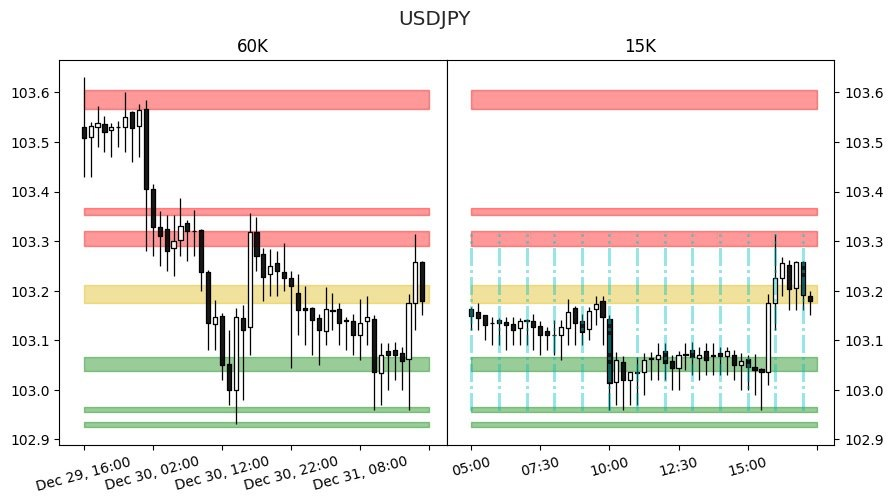
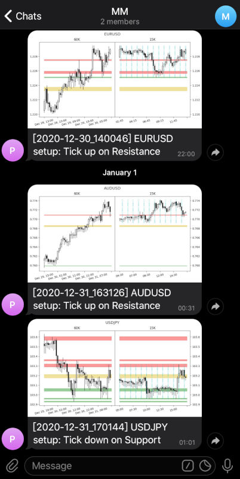
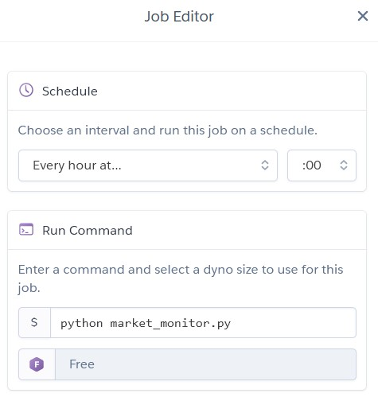

# Market Monitor

Python script to grab price data from Alpha Vantage API, process and if a trading setup is found, send Telegram bot notification with a rendered chart image.

The built-in algorithm uses multiple time frame analysis:
* First it finds Support (drawn as green) and Resistance (red) zones, and the golden zones which act as both roles, in the higher time frame.
* Then, if the price approaches these zones, find setups in the lower time frame.

#### Disclaimer: This tool is for educational purpose only. Nothing contained in this tool should be construed as investment advice.

## How to run locally

Fill your [Alpha Vantage API key](https://www.alphavantage.co/support/#api-key) and [Telegram bot token & Group Chat ID](https://dev.to/rizkyrajitha/get-notifications-with-telegram-bot-537l) into ``.env`` file, then run:

``python market_monitor.py daemon``

## How to deploy to Heroku

<pre>
(git clone this project and cd into it)
heroku login
heroku create {app_name}
heroku git:remote -a {app_name}
heroku config:set ALPHAVANTAGE_API_KEY="blah blah blah"
heroku config:set TELEGRAM_BOT_TOKEN="blah blah"
heroku config:set TELEGRAM_BOT_SEND_MESSAGE_GROUP_ID="blah"
git push heroku main
</pre>
Then install [Heroku Scheduler](https://elements.heroku.com/addons/scheduler) add-on, use it to **Add Job** for scheduled free one-off dynos with this command:

``python market_monitor.py``

